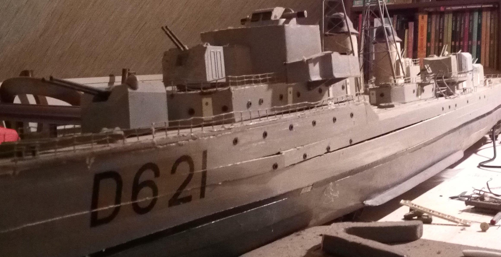

# D621 Surcouf (warship model)

This software is used to drive my model of D621 warship, built about 50 years ago. I just repaired it and allow its piloting by cell phone with video back.

This system can be put in any ship or model, it just need little adaptations.

## Material:
- [raspberry 3](https://www.amazon.co.uk/s/?ie=UTF8&keywords=raspberry+3&tag=mh0a9-21&index=aps&hvadid=8861242104&hvqmt=e&hvbmt=be&hvdev=c&ref=pd_sl_71j3ripqnu_e)
- [pca9685](https://www.amazon.co.uk/s/?ie=UTF8&keywords=pca9685&tag=mh0a9-21&index=aps&hvadid=79852064549173&hvqmt=e&hvbmt=be&hvdev=c&ref=pd_sl_17uxm2zcif_e)
- [servo motor](https://www.amazon.fr/s/ref=nb_sb_noss_2?__mk_fr_FR=%C3%85M%C3%85%C5%BD%C3%95%C3%91&url=search-alias%3Daps&field-keywords=servo+motor)
- motor(\*)

You can found some pieces on aliexpress for lower cost, but a longer delivery.

(\*) for the motor you can choose any one without problem, I chose a **Mecano** 6V engine.

## Software:
- nodejs: for human interfaces provider
	- iosoket
	- pca9685
- raspivid: for video 

This software is write in *javascript* for a *nodejs* server, you need a smartphone to drive this boat by WIFI.

It exist two interfaces to drive this boat. The light and normal:
- the light interface only permit to drive with video,
- the full interface allows to configure the driving parameters and to manage the servo motor camera. This interface also integrates a magnetometer, an infra-red form recognition, an augmented reality with picture of ship orientation and picture of camera orientation,

## Need to be done:
- [x] drive engine
- [ ] video stream
- [ ] magnetometer display
- [ ] orientation warship picture
- [ ] orientation camera picture
- [ ] form recognition
- [ ] augmented reality

## Picture:

